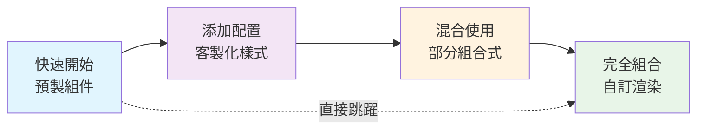

# D3 Components Registry Architecture Guidelines

*基於 shadcn 設計哲學的 D3.js + React 圖表組件庫架構指南*

## 📖 Overview

本文件定義了 D3 Components 圖表組件庫的核心架構原則與開發指南。我們採用 **shadcn/ui** 的設計哲學，結合 D3.js 和 React 的最佳實踐，建立一個高度可組合、類型安全且開發者友好的圖表組件生態系統。

### 🎯 核心理念

- **可組合性優先**: 從原子級組件構建複雜圖表
- **類型安全**: 完整的 TypeScript 支援
- **開發者體驗**: 直觀的 API 設計與完整文檔
- **效能優化**: 智能渲染與記憶體管理
- **無障礙支持**: 符合 WCAG 標準

---

## 🧩 1. Component Architecture Principles

### 核心哲學：「Composable by Design」

每個組件都應該遵循單一職責原則，通過組合而非繼承來構建複雜功能。

#### ✅ 良好的組合設計

```tsx
<ChartCanvas width={800} height={600}>
  <ScaleManager>
    <XAxis scale="linear" domain={[0, 100]} />
    <YAxis scale="linear" domain={[0, 50]} />
    <ScatterPlot 
      data={data} 
      xAccessor={d => d.x} 
      yAccessor={d => d.y}
    />
    <BrushZoom onZoom={handleZoom} />
    <CrosshairCursor />
  </ScaleManager>
</ChartCanvas>
```

#### ❌ 單體式設計（避免）

```tsx
<ScatterPlotWithEverything 
  data={data}
  showAxis={true}
  showBrush={true} 
  showTooltip={true}
  showCrosshair={true}
  // ... 100+ props
/>
```

## 🔄 雙層架構設計理念 (Progressive Chart Library)

D3 Components 採用「**漸進式複雜度**」設計哲學，提供雙層架構同時服務初階和進階使用者：

### 📊 Layer 1: Shadcn 模式 - 預製圖表層

**目標用戶**：初階開發者、產品團隊、快速原型開發

```tsx
// 🚀 零配置，開箱即用
import { BarChart } from '@/components/ui/bar-chart'

<BarChart 
  data={salesData}
  animate={true}
  colorScheme="blues"
/>
```

**特色**：
- ✅ **即插即用**：複製貼上即可使用
- ✅ **合理預設**：內建最佳實踐配置
- ✅ **快速開發**：適合 MVP 和標準圖表需求
- ✅ **設計一致**：統一的視覺語言

### 🔧 Layer 2: 組合平台 - 進階客製化層

**目標用戶**：進階開發者、視覺化專家、複雜業務需求

```tsx
// 🎨 完全組合式，無限彈性
import { ChartCanvas, XAxis, YAxis, Bar, Line, ScaleManager } from '@/components/primitives'

<ChartCanvas width={800} height={600}>
  <ScaleManager>
    <XAxis scale="band" position="bottom" />
    <YAxis scale="linear" position="left" />
    <YAxis scale="linear" position="right" />
    
    <Bar data={barData} xScale="x" yScale="leftY" />
    <Line data={lineData} xScale="x" yScale="rightY" />
    <CustomRenderer data={customData} />
  </ScaleManager>
</ChartCanvas>
```

**特色**：
- 🔧 **完全控制**：每個視覺元素都可客製化
- 🎯 **業務專用**：解決複雜特殊需求
- 🚀 **效能優化**：只載入需要的組件
- 🔗 **可擴展**：易於添加自訂邏輯

### 📈 漸進式學習路徑



**學習曲線設計**：
1. **新手友好**：從預製組件開始，快速看到成果
2. **自然進階**：需要時可以逐步深入客製化
3. **專家通道**：經驗豐富者可直接使用組合式 API
4. **向下兼容**：所有層級共享同一套設計系統

### 架構分層

```
┌─────────────────────────────────────┐
│    🚀 Layer 1: 預製圖表 (Shadcn)     │  ← 用戶友好層
│  BarChart, LineChart, PieChart...   │
├─────────────────────────────────────┤
│  🔧 Layer 2: 組合平台 (Primitives)  │  ← 專家工具層  
│   ChartCanvas, Axis, Shapes...      │
├─────────────────────────────────────┤
│         BaseChart Abstract          │  ← 抽象層
├─────────────────────────────────────┤
│       D3.js Core Logic Classes      │  ← 圖表邏輯層
├─────────────────────────────────────┤
│      Scale & Utility Systems        │  ← 基礎設施層
└─────────────────────────────────────┘
```

### 🎯 設計原則

1. **同一套核心**：兩層共享相同的設計系統、色彩規範、動畫原則
2. **平滑升級**：從 Layer 1 到 Layer 2 無需重寫，只需逐步解構
3. **性能一致**：兩層都基於相同的高效 D3 實現
4. **文檔統一**：一套學習材料，多種使用方式

---

## 📊 2. Data Flow & API Consistency

### 統一資料介面模式

所有圖表組件都必須支援一致的資料輸入格式：

```typescript
interface ChartProps<T = any> extends BaseChartProps {
  // 原始資料輸入
  data: T[];
  
  // 資料存取函數（推薦）
  xAccessor?: (d: T) => any;
  yAccessor?: (d: T) => any;
  colorAccessor?: (d: T) => string;
  sizeAccessor?: (d: T) => number;
  
  // 或基於鍵值的存取（向下兼容）
  xKey?: keyof T;
  yKey?: keyof T;
  colorKey?: keyof T;
  sizeKey?: keyof T;
}
```

### 事件處理標準化

```typescript
interface ChartEventHandlers<T> {
  // 資料交互事件
  onDataClick?: (data: T, event: MouseEvent) => void;
  onDataHover?: (data: T | null, event: MouseEvent) => void;
  onDataDoubleClick?: (data: T, event: MouseEvent) => void;
  
  // 圖表狀態事件
  onZoom?: (domain: ScaleDomain) => void;
  onZoomReset?: () => void;
  onBrushStart?: (selection: BrushSelection) => void;
  onBrushEnd?: (selection: BrushSelection) => void;
  
  // 渲染生命週期事件
  onRenderStart?: () => void;
  onRenderComplete?: () => void;
  onError?: (error: Error) => void;
}
```

---

## 🔒 3. TypeScript & Type Safety

### 嚴格類型定義要求

每個組件都必須提供完整的 TypeScript 類型定義：

```typescript
// 處理後的資料點介面
export interface ProcessedDataPoint {
  x: number | Date | string;
  y: number;
  originalData: any;
  group?: string;
  color?: string;
  size?: number;
  [key: string]: any; // 允許自定義屬性
}

// 圖表比例尺介面
export interface ChartScales {
  x: d3.ScaleLinear<number, number> | d3.ScaleTime<number, number> | d3.ScaleBand<string>;
  y: d3.ScaleLinear<number, number>;
  color?: d3.ScaleOrdinal<string, string>;
  size?: d3.ScaleLinear<number, number>;
}

// 通用圖表組件約束
export interface ChartComponent<T extends Record<string, any>> {
  data: T[];
  processData(data: T[]): ProcessedDataPoint[];
  validateData(data: T[]): boolean;
}
```

### 泛型約束模式

```typescript
// ✅ 正確的泛型使用
interface ScatterPlotProps<T extends Record<string, any> = any> 
  extends ChartProps<T> {
  radius?: number;
  showTrendline?: boolean;
}

// ❌ 避免過於寬泛的類型
interface BadProps {
  data: any[]; // 太寬泛
  accessor: Function; // 缺乏約束
}
```

---

## 🏗️ 4. Composition Standards

### BaseChart 抽象類別要求

所有圖表核心邏輯都必須繼承 BaseChart：

```typescript
abstract class BaseChart<T = any, P = any> {
  protected svgElement: SVGSVGElement;
  protected props: P;
  protected dimensions: ChartDimensions;
  
  // 必須實現的抽象方法
  abstract processData(data: T[]): ProcessedDataPoint[];
  abstract createScales(): ChartScales;
  abstract renderChart(): void;
  abstract getChartType(): string;
  
  // 可選擇覆寫的方法
  validateData(data: T[]): boolean { /* 預設實現 */ }
  updateChart(newProps: Partial<P>): void { /* 預設實現 */ }
  destroy(): void { /* 清理邏輯 */ }
}
```

### 比例尺管理模式

所有組件必須使用集中式比例尺管理：

```typescript
// 在組件中使用比例尺管理器
const ScatterPlot: React.FC<ScatterPlotProps> = (props) => {
  const scaleManager = useScaleManager();
  
  useEffect(() => {
    // 註冊比例尺
    scaleManager.registerScale('x', xScale);
    scaleManager.registerScale('y', yScale);
    scaleManager.registerScale('color', colorScale);
    
    return () => {
      // 清理比例尺
      scaleManager.unregisterScale('x');
      scaleManager.unregisterScale('y');
      scaleManager.unregisterScale('color');
    };
  }, [scaleManager, xScale, yScale, colorScale]);
};
```

---

## ⚡ 5. Performance & Optimization

### 渲染優化規則

#### DOM 分離模式
```typescript
// ✅ 正確的 D3 + React 整合
const ChartComponent: React.FC = () => {
  const svgRef = useRef<SVGSVGElement>(null);
  
  useEffect(() => {
    if (svgRef.current) {
      // D3 操作分離的 SVG 元素
      const chart = new D3ChartClass(svgRef.current, props);
      chart.render();
      
      return () => chart.destroy();
    }
  }, [props]);
  
  return <svg ref={svgRef} />;
};
```

#### 資料記憶化
```typescript
// ✅ 昂貴運算的記憶化
const processedData = useMemo(
  () => processChartData(data, xAccessor, yAccessor),
  [data, xAccessor, yAccessor]
);

const scales = useMemo(
  () => createScales(processedData, dimensions),
  [processedData, dimensions]
);
```

#### 選擇性重渲染
```typescript
// ✅ 智能更新模式
class D3Chart extends BaseChart {
  updateChart(newProps: Partial<Props>): void {
    const changedProps = this.getChangedProps(this.props, newProps);
    
    if (changedProps.includes('data')) {
      this.processData(newProps.data);
      this.renderChart();
    } else if (changedProps.includes('colors')) {
      this.updateColors(newProps.colors);
    }
    // 只更新必要的部分
  }
}
```

---

## ♿ 6. Accessibility & UX

### 無障礙功能要求

```typescript
interface AccessibilityProps {
  // ARIA 標籤
  'aria-label'?: string;
  'aria-describedby'?: string;
  'aria-labelledby'?: string;
  
  // 鍵盤導覽
  tabIndex?: number;
  onKeyDown?: (event: KeyboardEvent) => void;
  
  // 螢幕閱讀器支援
  role?: string;
  'aria-live'?: 'polite' | 'assertive';
}
```

### 實作範例
```typescript
const AccessibleChart: React.FC = (props) => {
  return (
    <svg
      role="img"
      aria-label={`散點圖顯示 ${data.length} 個資料點`}
      aria-describedby="chart-description"
      tabIndex={0}
      onKeyDown={handleKeyboardNavigation}
    >
      <desc id="chart-description">
        {generateChartSummary(data)}
      </desc>
      {/* 圖表內容 */}
    </svg>
  );
};
```

### 顏色無障礙
```typescript
// ✅ 提供多種視覺提示
const DataPoint: React.FC = ({ data, color, shape }) => (
  <circle
    fill={color}
    r={data.size}
    stroke={data.isHighlighted ? '#000' : 'none'}
    strokeWidth={2}
    // 形狀區分（不只靠顏色）
    style={{ 
      filter: data.category === 'A' ? 'url(#pattern-dots)' : 'none' 
    }}
  />
);
```

---

## 🎨 7. Theming & Styling

### 主題系統架構

```typescript
interface ChartTheme {
  colors: {
    primary: string;
    secondary: string;
    accent: string;
    background: string;
    text: string;
    border: string;
    // 資料系列顏色
    categorical: string[];
    sequential: string[];
    diverging: string[];
  };
  
  spacing: {
    xs: number; // 4px
    sm: number; // 8px
    md: number; // 16px
    lg: number; // 24px
    xl: number; // 32px
  };
  
  typography: {
    fontFamily: string;
    fontSize: {
      xs: number;
      sm: number;
      md: number;
      lg: number;
    };
    fontWeight: {
      normal: number;
      medium: number;
      bold: number;
    };
  };
  
  borderRadius: {
    none: number;
    sm: number;
    md: number;
    lg: number;
  };
  
  shadow: {
    sm: string;
    md: string;
    lg: string;
  };
}
```

### CSS-in-JS 模式
```typescript
const useChartStyles = (theme: ChartTheme) => ({
  container: {
    fontFamily: theme.typography.fontFamily,
    backgroundColor: theme.colors.background,
    border: `1px solid ${theme.colors.border}`,
    borderRadius: theme.borderRadius.md,
    boxShadow: theme.shadow.sm,
  },
  
  axis: {
    stroke: theme.colors.text,
    fontSize: theme.typography.fontSize.sm,
  },
  
  dataPoint: {
    fill: theme.colors.primary,
    stroke: theme.colors.background,
    strokeWidth: 1,
  },
});
```

---

## 🧪 8. Testing Standards

### 必要測試涵蓋範圍

每個組件都必須包含以下測試：

```typescript
describe('ChartComponent', () => {
  // 基本渲染測試
  it('should render with minimal props', () => {
    render(<ChartComponent data={mockData} />);
    expect(screen.getByRole('img')).toBeInTheDocument();
  });
  
  // 資料更新測試
  it('should update when data changes', () => {
    const { rerender } = render(<ChartComponent data={data1} />);
    rerender(<ChartComponent data={data2} />);
    // 驗證圖表已更新
  });
  
  // 事件處理測試
  it('should emit correct events on interaction', () => {
    const mockHandler = jest.fn();
    render(<ChartComponent data={mockData} onDataClick={mockHandler} />);
    
    fireEvent.click(screen.getByTestId('data-point-0'));
    expect(mockHandler).toHaveBeenCalledWith(mockData[0], expect.any(Object));
  });
  
  // 無障礙測試
  it('should be accessible', async () => {
    const { container } = render(<ChartComponent data={mockData} />);
    const results = await axe(container);
    expect(results).toHaveNoViolations();
  });
  
  // 邊界情況測試
  it('should handle empty data gracefully', () => {
    render(<ChartComponent data={[]} />);
    expect(screen.getByText('No data available')).toBeInTheDocument();
  });
  
  // 效能測試
  it('should handle large datasets efficiently', () => {
    const largeData = generateMockData(10000);
    const startTime = performance.now();
    
    render(<ChartComponent data={largeData} />);
    
    const renderTime = performance.now() - startTime;
    expect(renderTime).toBeLessThan(1000); // 1秒內完成
  });
});
```

### 視覺回歸測試
```typescript
// 使用 Chromatic 或類似工具
describe('Visual Tests', () => {
  it('should match visual snapshot', () => {
    const component = render(<ChartComponent data={standardData} />);
    expect(component).toMatchSnapshot();
  });
});
```

---

## 📚 9. Developer Experience

### 文檔要求

#### API 參考文檔
```typescript
/**
 * ScatterPlot - 散點圖組件
 * 
 * @example
 * ```tsx
 * <ScatterPlot
 *   data={salesData}
 *   xAccessor={d => d.revenue}
 *   yAccessor={d => d.profit}
 *   colorAccessor={d => d.region}
 *   onDataClick={(data, event) => console.log('Clicked:', data)}
 * />
 * ```
 * 
 * @param data - 圖表資料陣列
 * @param xAccessor - X 軸資料存取函數
 * @param yAccessor - Y 軸資料存取函數
 * @param colorAccessor - 顏色對映函數（可選）
 * @param onDataClick - 資料點點擊事件處理器（可選）
 */
export interface ScatterPlotProps<T = any> extends BaseChartProps {
  data: T[];
  xAccessor: (d: T) => number;
  yAccessor: (d: T) => number;
  colorAccessor?: (d: T) => string;
  onDataClick?: (data: T, event: MouseEvent) => void;
}
```

#### 程式碼範例
```typescript
// 基礎使用
const BasicExample = () => (
  <ScatterPlot
    data={salesData}
    xAccessor={d => d.revenue}
    yAccessor={d => d.profit}
  />
);

// 進階客製化
const AdvancedExample = () => (
  <ChartCanvas theme={customTheme}>
    <ScatterPlot
      data={salesData}
      xAccessor={d => d.revenue}
      yAccessor={d => d.profit}
      colorAccessor={d => d.region}
      sizeAccessor={d => d.employees}
      showTrendline
      enableBrushZoom
      onDataClick={handleDataClick}
    />
  </ChartCanvas>
);
```

### 錯誤處理與偵錯

```typescript
// 開發模式下的詳細錯誤訊息
const validateProps = (props: ChartProps) => {
  if (process.env.NODE_ENV === 'development') {
    if (!props.data || !Array.isArray(props.data)) {
      console.error('ScatterPlot: data prop must be an array');
    }
    
    if (props.data.length === 0) {
      console.warn('ScatterPlot: data array is empty');
    }
    
    if (!props.xAccessor || typeof props.xAccessor !== 'function') {
      console.error('ScatterPlot: xAccessor must be a function');
    }
  }
};
```

---

## 🔄 10. Component Lifecycle

### 標準組件結構

```
registry/components/[category]/[component-name]/
├── core/
│   ├── [component-name].ts          # D3 邏輯類別
│   ├── types.ts                     # TypeScript 定義
│   └── utils.ts                     # 輔助工具函數
├── [component-name].tsx             # React 包裝組件
├── [component-name].stories.tsx     # Storybook 故事
├── [component-name].test.tsx        # 單元測試
├── [component-name].mdx             # 文檔
├── index.ts                         # 公開匯出
└── README.md                        # 組件說明
```

### 組件生命週期管理

```typescript
class D3Chart extends BaseChart {
  // 初始化
  constructor(element: SVGSVGElement, props: ChartProps) {
    super(element, props);
    this.initialize();
  }
  
  // 初始設定
  protected initialize(): void {
    this.setupContainer();
    this.bindEventListeners();
    this.processData(this.props.data);
    this.createScales();
    this.renderChart();
  }
  
  // 更新處理
  updateChart(newProps: Partial<ChartProps>): void {
    const changes = this.detectChanges(this.props, newProps);
    this.props = { ...this.props, ...newProps };
    
    if (changes.data) {
      this.processData(this.props.data);
      this.updateScales();
      this.renderChart();
    } else if (changes.styling) {
      this.updateStyling();
    }
  }
  
  // 清理資源
  destroy(): void {
    this.removeEventListeners();
    this.clearAnimations();
    this.clearContainer();
  }
}
```

---

## 🏥 Health Check Framework

基於上述原則，註冊表健檢應該評估以下七個面向：

### 1. **Architecture Compliance** 
- 是否遵循 BaseChart 抽象模式？
- 組件是否具備適當的職責分離？
- 是否使用依賴注入而非硬編碼依賴？

### 2. **API Consistency**
- props 命名是否遵循統一規範？
- 事件處理器命名是否一致？
- 資料存取模式是否標準化？

### 3. **Type Safety**
- 是否有完整的 TypeScript 定義？
- 泛型約束是否適當？
- 是否避免 `any` 類型的濫用？

### 4. **Performance**
- 是否使用適當的記憶化策略？
- 大數據集處理是否優化？
- 是否避免不必要的重渲染？

### 5. **Composition**
- 組件是否可以有效組合？
- 比例尺管理是否集中化？
- 是否支援主題系統？

### 6. **Testing**
- 是否有足夠的測試涵蓋範圍？
- 是否包含無障礙測試？
- 是否有效能測試？

### 7. **Documentation**
- 是否有清晰的 API 文檔？
- 是否提供實用的程式碼範例？
- 是否有遷移指南？

---

## 🚀 4-Phase Implementation Roadmap

### **Phase 1: Establish Standards Framework**

**目標**: 建立完整的標準和規範基礎設施

**具體行動**:
- ✅ 創建架構指導原則文件 (`ARCHITECTURE_GUIDELINES.md`)
- 建立組件模板 (`templates/component-template/`)
- 定義 TypeScript 接口標準 (`types/standards.ts`)
- 創建測試模板 (`templates/test-template/`)
- 設定 ESLint 規則 (`.eslintrc.component.js`)

**產出物**:
```
docs/
├── ARCHITECTURE_GUIDELINES.md        # 本文件
├── COMPONENT_TEMPLATE.md             # 組件創建模板
├── API_DESIGN_STANDARDS.md           # API 設計標準
└── TESTING_GUIDELINES.md             # 測試指南

templates/
├── component-template/               # 新組件腳手架
├── test-template/                   # 測試模板
└── storybook-template/              # Storybook 模板
```

### **Phase 2: Automated Analysis Tools**

**目標**: 建立自動化分析和檢查工具

**具體行動**:
- 開發組件一致性檢查工具 (`scripts/health-check.js`)
- 建立 API 合規性驗證工具 (`scripts/api-validator.js`)
- 創建效能分析腳本 (`scripts/performance-analyzer.js`)
- 設定無障礙測試自動化 (`scripts/a11y-checker.js`)
- 建立文檔完整性檢查 (`scripts/docs-validator.js`)

**產出物**:
```bash
# 健康檢查指令
npm run health-check              # 完整健康檢查
npm run health-check:api          # API 一致性檢查  
npm run health-check:perf         # 效能分析
npm run health-check:a11y         # 無障礙檢查
npm run health-check:docs         # 文檔檢查
```

### **Phase 3: Component-by-Component Audit**

**目標**: 系統性審計每個組件的合規性

**具體行動**:
- 審計基礎圖表 (`basic-charts/`)
- 審計統計圖表 (`statistical-charts/`)
- 審計金融圖表 (`financial-charts/`)
- 審計原子組件 (`primitives/`)
- 審計組合圖表 (`composite/`)

**評估矩陣**:
```typescript
interface ComponentHealthReport {
  component: string;
  scores: {
    architecture: number;     // 0-100
    apiConsistency: number;   // 0-100
    typeSafety: number;       // 0-100
    performance: number;      // 0-100
    composition: number;      // 0-100
    testing: number;         // 0-100
    documentation: number;    // 0-100
  };
  overallScore: number;       // 0-100
  criticalIssues: string[];
  recommendations: string[];
}
```

**產出物**:
```
reports/
├── health-report.json           # 完整健康報告
├── component-scores.csv         # 組件評分表
├── critical-issues.md           # 關鍵問題清單
└── refactoring-roadmap.md       # 重構路線圖
```

### **Phase 4: Implementation & Validation**

**目標**: 實施修復並驗證改善效果

**具體行動**:
- 修復高優先級問題（評分 < 60 的組件）
- 驗證組件組合功能正確性
- 更新文檔和範例程式碼
- 建立持續健康監控機制
- 設定 CI/CD 品質門檻

**成功指標**:
- 所有組件評分 > 80
- 100% TypeScript 覆蓋率
- 90%+ 測試覆蓋率
- 0 個關鍵安全性問題
- 完整的組件組合測試通過

**持續改善機制**:
```bash
# 預提交鉤子
npm run pre-commit               # 程式碼品質檢查
npm run pre-push                # 完整測試套件

# CI/CD 品質門檻
npm run ci:health-check         # 自動健康檢查
npm run ci:regression-test      # 回歸測試
npm run ci:performance-test     # 效能測試
```

---

## 📈 成功衡量指標

### 量化指標
- **程式碼品質**: ESLint 違規數量 < 10
- **類型安全**: TypeScript 嚴格模式無錯誤
- **測試覆蓋**: 程式碼覆蓋率 > 90%
- **效能**: 大數據集 (10K+ 點) 渲染時間 < 1秒
- **無障礙**: WCAG AA 合規率 100%

### 質性指標
- **開發者體驗**: 新組件開發時間減少 50%
- **維護性**: 程式碼複雜度降低
- **可重用性**: 組件跨專案使用率提升
- **文檔完整性**: API 文檔自動生成率 100%

---

## 🔗 相關資源

### 參考文檔
- [shadcn/ui Design System](https://ui.shadcn.com/)
- [D3.js Best Practices](https://github.com/d3/d3/wiki)
- [React + D3 Integration Patterns](https://2019.wattenberger.com/blog/react-and-d3)
- [TypeScript Handbook](https://www.typescriptlang.org/docs/)

### 工具與函式庫
- [Storybook](https://storybook.js.org/) - 組件開發環境
- [Chromatic](https://www.chromatic.com/) - 視覺測試
- [jest-axe](https://github.com/nickcolley/jest-axe) - 無障礙測試
- [ESLint](https://eslint.org/) - 程式碼規範檢查

---

**版本**: 1.0.0  
**最後更新**: 2025-08-23  
**維護者**: D3 Components Team